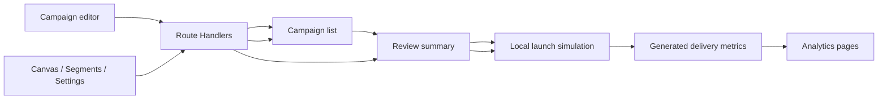

# 本地架构与数据闭环

## 边界

本项目是营销控制台的本地交互演示，不是外部消息基础设施。前端运行于 Next.js App Router；本地 Route Handlers 使用 Node.js 内置 SQLite（`node:sqlite`）将数据保存在 `.data/braze-local.sqlite`。无需凭证或第三方服务即可演示。

## 当前数据流

活动的主键是 `cmp_*`。每个活动保存 `channel`、`status`、`schedule`、`audience`、`conversion`、`subject` 和 `body`。同一活动的编辑、列表与审核摘要读取同一个对象，避免按渠道共享草稿导致的覆盖问题。

## 生产化替换设计

若需要升级为多用户持久化版本，可将当前 store 映射到 SQLite：

| 实体 | 关键字段 |
|---|---|
| campaign | id, workspace_id, name, channel, status, schedule, version |
| message_variant | id, campaign_id, ordinal, config_json |
| audience_rule | id, campaign_id, include_json, exclude_json, subscription_group_id |
| execution_snapshot | id, campaign_id, version, state, scheduled_at, idempotency_key |
| message_event | id, snapshot_id, user_id, channel, event_type, occurred_at, payload_json |
| user_profile | id, external_id, attributes_json, subscription_state |

执行器应读取不可变 `execution_snapshot`，依次进行受众过滤、订阅与频控检查、稳定分桶、Liquid 渲染和渠道 adapter 投递。Webhook adapter 默认禁用外联；生产部署时必须使用网络白名单、超时、重试、签名和审计日志。

## 失败与幂等

- 草稿可以不完整；发布前校验必填渠道字段、受众和转化目标。
- 发布键由活动 ID 与版本组成，重复提交只返回同一个快照。
- 内容渲染错误、无可达设备、退订、频控、通道拒绝必须保留为不同事件类型。
- 真实系统中 UI 保存采用乐观锁版本号，冲突时展示明确的重新加载与比较入口。
