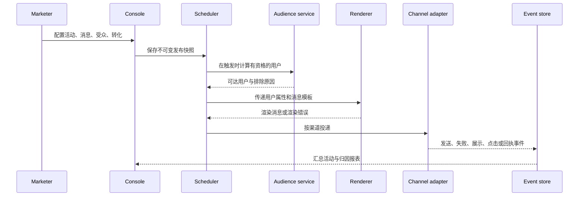

# 营销渠道配置与投递逻辑

本文解释常见营销消息系统的公开工作方式，以及本地演示如何简化它们。文中不声称描述 Braze 的非公开内部实现。官方行为以 [Braze 用户指南](https://www.braze.com/docs/user_guide/home) 与对应渠道文档为准；查阅日期为 2026-09-16。

## 统一投递链路



核心顺序不能反过来：先冻结配置，再计算资格，最后投递。活动编辑中的草稿不应改写已运行任务。每次投递使用 `snapshot_id + user_id + variant_id` 形成幂等键。

## 标识、设备与订阅

用户通常有稳定的 `external_id`，可附带匿名 ID、邮箱、手机号、设备 token 和自定义属性。邮箱或手机号本身不能替代稳定用户 ID：一个用户可能有多个设备，一个联系方式可能被多个用户共享。

订阅组保存用户对营销或事务性消息的许可。资格服务需要同时检查：受众规则、渠道地址、用户退订状态、频控、静默时段、实验分组和活动再次进入规则。被排除的用户也应记录原因，才能解释“为什么没有发”。

## Email

配置包含发送显示名、发送地址、主题、预标题、HTML/拖拽内容、链接、退订和发送域。生产系统由邮件服务商排队投递；域名应配置 SPF、DKIM 和 DMARC，退信、投诉、退订和送达由服务商回传。

```json
{"from":"offers@example.com","subject":"Your September offer","html":"<h1>Hello {{first_name}}</h1>","subscription_group":"promotional"}
```

打开事件受客户端缓存、隐私保护和图片加载影响，不能当作准确的阅读量。常见失败包括域名未验证、退信、邮件地址无效和收件人退订。本地演示只更新消息事件，不发送 SMTP 请求。

## Mobile / Web Push

移动 Push 最终经过 iOS 的 APNs 或 Android 的 FCM；Web Push 使用浏览器订阅和 push service。应用 SDK 在用户授权后收集 token，服务端将 token、payload、TTL、深链等交给平台。平台接受请求不等于设备展示：设备离线、token 失效、用户关闭通知和系统节流都会改变最终结果。

```json
{"title":"Your offer is here","body":"Tap to unlock 20% off","deep_link":"myapp://offers/september","ttl_seconds":86400}
```

Token 失效必须回写并停止继续使用。前台展示、打开、影响打开等事件由 SDK 或应用回传。本地 demo 以 `sent / delivered / open` 合成事件表现，不连接 APNs、FCM 或浏览器 Push 服务。

## In-app message、Content Cards 与 Banners

三者都依赖 App/Web SDK 拉取或接收配置，但呈现模型不同：

| 渠道 | 触发与呈现 | 主要事件 |
|---|---|---|
| In-app message | 用户活跃时 SDK 根据触发条件立即展示 overlay | impression、click、dismiss |
| Content Card | SDK 同步一组卡片，宿主 App 在信息流中渲染 | impression、click、dismiss |
| Banner | SDK 或宿主注册 placement，按优先级在页面区域内渲染 | impression、click |

HTML In-app message 和 Banner 存在脚本执行风险。官方 Web SDK 默认限制用户提供 JavaScript 与 HTML 交互行为；生产实现须净化 HTML、限制 URL Scheme，并对自定义事件采用白名单。本地演示只渲染安全的固定预览片段。

## SMS、MMS、RCS、WhatsApp 与 LINE

SMS/MMS/RCS 需要号码、发送池或 Sender，订阅组和地区合规配置。字符编码决定分段：GSM-7 与 UCS-2 的单段长度不同，媒体会走 MMS 或 RCS 支持的通道。运营商回执通常包含 accepted、delivered、failed、rejected，退订关键字必须立即更新用户订阅状态。

WhatsApp 使用 Business Account、号码和 Meta 审批模板。模板有语言、参数、媒体和按钮；营销类内容在允许的会话或模板规则内发送。LINE 使用 Official Account、用户映射和渠道凭证，支持文本、图片、卡片等消息。两者的真实配置都包含供应商认证与审核；本项目只展示字段和模拟状态，不保存或传输凭证。

## Webhook

Webhook 将活动上下文渲染为 HTTP 请求。必须配置 URL、方法、headers、认证和 body，推荐为每个请求加幂等键并记录响应。

```http
POST https://partner.example/events
Authorization: Bearer redacted
Idempotency-Key: snapshot_123:user_456:variant_a
Content-Type: application/json

{"user_id":"user_456","event":"campaign_sent"}
```

服务端需要连接超时、总体超时、有限重试、重试退避、URL 白名单与私网地址拦截。HTTP 200 表示服务端接受请求，不代表业务完成。当前本地版本不解析或调用填写的 URL，只在预览与日志中显示合成响应。

## 调度、频控、实验与归因

定时发送使用工作区或用户本地时区。行为触发与 API 触发由事件进入任务队列；再次进入资格必须以用户和活动维度保存状态。频控会在入队和实际发送前重复检查，以避免延时任务绕过限制。

实验分桶应使用稳定哈希，例如 `hash(user_id + experiment_id) % 10000`，保证用户多次进入时仍处于同一变体。归因由送达或展示事件开始，在转化窗口内匹配用户事件；多渠道、控制组和延迟上报会影响统计口径。活动上线后不能随意改写转化目标，避免历史报表失真。

## 本地模拟与生产替换对照

| 能力 | 本地演示 | 生产替换 |
|---|---|---|
| 数据持久化 | 浏览器 localStorage | SQLite/PostgreSQL + 版本控制 |
| 调度 | 点击发布即时生成事件 | 队列、Worker、延迟任务和重试 |
| 渠道投递 | Mock adapter | ESP、APNs、FCM、运营商、Meta、LINE API |
| Webhook | 不外联的请求预览 | 白名单 HTTP client、签名、超时与审计 |
| 报表 | 确定性模拟指标 | 事件仓库、聚合任务与归因模型 |
| AI / SQL | 明示为本地演示 | 受控模型、权限、成本与审计策略 |
